<div align="center">

# 🛡️ Self-Healing ML Microservice Mesh

### A Production-Grade, Resilient Machine Learning Platform for Real-Time Fraud Detection

[](https://python.org)
[](https://fastapi.tiangolo.com)
[](https://docker.com)
[](https://mlflow.org)
[](https://prometheus.io)
[](https://grafana.com)
[](LICENSE)

*Beyond model training — this project demonstrates real-world ML engineering: versioned models, live traffic routing, automated retraining, observability, and fault tolerance under production constraints.*

</div>

---

## 📑 Table of Contents

- [Why This Project](#-why-this-project)
- [System Architecture](#-system-architecture)
- [Key Capabilities](#-key-capabilities)
- [How It Works](#-how-it-works)
- [Tech Stack](#-tech-stack)
- [Project Structure](#-project-structure)
- [Getting Started](#-getting-started)
- [Usage & API Reference](#-usage--api-reference)
- [Observability & Dashboards](#-observability--dashboards)
- [Resilience & Self-Healing](#-resilience--self-healing)
- [Testing](#-testing)
- [CI/CD Pipeline](#-cicd-pipeline)
- [Kubernetes Deployment](#-kubernetes-deployment-optional)
- [Design Decisions](#-design-decisions)
- [License](#-license)

---

## 🎯 Why This Project

Most ML portfolios stop at Jupyter notebooks and accuracy metrics. Production ML is fundamentally different — it requires:

| Production Challenge | How This Project Addresses It |
|---|---|
| **Model Versioning** | MLflow registry with multiple model versions |
| **Safe Deployments** | Canary routing with configurable traffic splits |
| **Failure Recovery** | Circuit breakers, cascading failover, heuristic fallback |
| **Data Drift** | KS test + PSI statistical monitoring on live features |
| **Auto-Retraining** | Prefect pipeline triggered on drift detection |
| **Observability** | Prometheus metrics + Grafana dashboards (P50/P95/P99) |
| **Scalability** | Docker Compose + optional Kubernetes with HPA |

This system runs a **tabular fraud detection use case** with synthetic transactional data — but the architecture is generalizable to any ML workload.

---

## 🏗️ System Architecture

### High-Level Overview

```mermaid
graph TB
    subgraph Client Layer
        CL[Client / Load Test]
    end

    subgraph API Gateway :8000
        GW[FastAPI Gateway]
        RT[Traffic Router]
        SH[Shadow Evaluator]
        RB[Rollback Manager]
    end

    subgraph Inference Layer
        XGB[🌲 XGBoost Service :8001]
        PT[🔥 PyTorch Service :8002]
        FB[📏 Fallback Heuristic :8003]
    end

    subgraph Data Layer
        RD[(Redis :6379<br/>Feature Store)]
        MLF[📊 MLflow :5000<br/>Model Registry]
    end

    subgraph Observability
        PROM[📈 Prometheus :9090]
        GRAF[📉 Grafana :3000]
    end

    subgraph ML Lifecycle
        DD[🔍 Drift Detector]
        RE[🔄 Prefect Retraining]
    end

    CL -->|POST /api/v1/predict| GW
    GW --> RT
    RT -->|80% traffic| XGB
    RT -->|20% traffic| PT
    RT -.->|fallback| FB
    SH -.->|shadow eval| PT

    GW --> RD
    RE --> MLF
    RD --> DD
    DD -->|drift trigger| RE
    RE -->|deploy canary| GW

    XGB --> PROM
    PT --> PROM
    GW --> PROM
    PROM --> GRAF

    style GW fill:#1a1a2e,color:#e94560
    style XGB fill:#0f3460,color:#e94560
    style PT fill:#0f3460,color:#e94560
    style FB fill:#533483,color:#e94560
    style PROM fill:#16213e,color:#e94560
    style GRAF fill:#16213e,color:#e94560
```



### Request Flow — What Happens on a Prediction Call


### ML Lifecycle — Retraining & Self-Healing Loop

```mermaid
flowchart LR
    subgraph Monitor
        A[📊 Live Traffic] --> B[📐 Feature Store]
        B --> C{🔍 Drift<br/>Detected?}
    end

    subgraph Retrain
        C -->|Yes| D[📦 Generate<br/>Fresh Data]
        D --> E[🏋️ Retrain<br/>XGBoost]
        E --> F[📝 Log to<br/>MLflow]
        F --> G[✅ Register<br/>New Version]
    end

    subgraph Deploy
        G --> H[🐤 Deploy as<br/>Canary 10%]
        H --> I{📈 Canary<br/>Healthy?}
        I -->|✅ Yes| J[🚀 Promote<br/>to 100%]
        I -->|❌ No| K[⏪ Auto<br/>Rollback]
    end

    C -->|No| L[✅ Continue<br/>Monitoring]

    style C fill:#ff9800,color:#000
    style I fill:#ff9800,color:#000
    style J fill:#4caf50,color:#fff
    style K fill:#f44336,color:#fff
```



---

## 🔑 Key Capabilities

### 🧠 Multi-Model Inference
- **XGBoost v1** — Gradient-boosted tree classifier (primary model)
- **PyTorch MLP v1** — 3-layer neural network with BatchNorm (canary/secondary)
- **Fallback Heuristic** — Rule-based scoring (zero ML dependency, always available)

### 🔀 Intelligent Traffic Routing
- Weighted random routing with configurable splits (e.g., 80/20)
- Dynamic traffic updates via API (`POST /api/v1/traffic`)
- **Shadow evaluation** — new models receive live traffic and log predictions without affecting responses

### 🛡️ Circuit Breaker & Failover
```
Primary Model ──[fails]──> Alternate ML Model ──[fails]──> Heuristic Fallback ──[fails]──> Conservative Default
     ↑                                                                                           │
     └─── Recovery (HALF_OPEN probe) ────────────────────────────────────────────────────────────┘
```

States: **CLOSED** (healthy) → **OPEN** (after N failures) → **HALF_OPEN** (recovery probe after timeout)

### 📉 Drift Detection
- **KS Test** (Kolmogorov-Smirnov) — Detects distribution shifts per feature
- **PSI** (Population Stability Index) — Measures magnitude of shift
  - PSI < 0.1 → No action
  - 0.1 ≤ PSI < 0.2 → Monitor closely
  - PSI ≥ 0.2 → Trigger retraining

### 🔄 Automated Retraining
Prefect orchestrates a 5-step pipeline:
1. Check drift scores → decide if retraining needed
2. Generate fresh synthetic data
3. Retrain model with MLflow logging
4. Register new version in model registry
5. Deploy as canary (10% traffic)

### 📊 Observability
Every service exposes `/metrics` for Prometheus, with a pre-built Grafana dashboard covering:

| Metric | Type | Description |
|--------|------|-------------|
| Latency P50/P95/P99 | Histogram | Per-service response time percentiles |
| RPS | Counter | Requests per second by model version |
| Error Rate | Gauge | % of failed requests with color thresholds |
| Traffic Distribution | Pie Chart | Visual split across XGBoost / PyTorch / Fallback |
| Service Health | Status | UP/DOWN per service |
| Fallback Usage | Counter | Tracks when ML services are degraded |
| Prediction Classes | Counter | Fraud vs. legitimate prediction rates |

---

## ⚙️ Tech Stack

| Layer | Technology | Purpose |
|-------|-----------|---------|
| **ML Models** | XGBoost, PyTorch | Fraud classification |
| **API** | FastAPI, Uvicorn | High-performance async service layer |
| **Routing** | Custom Python | Weighted routing, circuit breaker, shadow eval |
| **Feature Store** | Redis Streams | Online feature logging & retrieval |
| **Drift Detection** | SciPy (KS test), Custom PSI | Statistical distribution monitoring |
| **Experiment Tracking** | MLflow | Model registry, param/metric logging |
| **Orchestration** | Prefect | Automated retraining DAG |
| **Monitoring** | Prometheus + Grafana | Metrics collection & dashboards |
| **Containerization** | Docker, Docker Compose | Service isolation & orchestration |
| **Scaling** | Kubernetes (HPA) | Horizontal pod autoscaling |
| **CI/CD** | GitHub Actions | Lint, test, build, security scan |
| **Load Testing** | Locust | Concurrent traffic simulation |

---

## 📁 Project Structure

```
Self_healing_ML_mesh/
│
├── 📊 data/
│   └── generate_dataset.py          # Synthetic fraud transaction generator (50k rows)
│
├── 🏋️ training/
│   ├── feature_engineering.py       # Shared feature transforms (train-serve parity)
│   ├── train_xgboost.py             # XGBoost training + MLflow logging
│   ├── train_pytorch.py             # PyTorch MLP training + MLflow logging
│   └── requirements.txt
│
├── 🚀 inference/
│   ├── xgboost_service/             # XGBoost model server (FastAPI + Docker)
│   │   ├── app.py
│   │   ├── Dockerfile
│   │   └── requirements.txt
│   ├── pytorch_service/             # PyTorch model server (FastAPI + Docker)
│   │   ├── app.py
│   │   ├── Dockerfile
│   │   └── requirements.txt
│   └── fallback_service/            # Rule-based heuristic fallback
│       ├── app.py
│       ├── Dockerfile
│       └── requirements.txt
│
├── 🚪 gateway/
│   ├── app.py                       # API gateway (single entry point)
│   ├── router.py                    # Weighted routing + circuit breaker
│   ├── shadow.py                    # Shadow evaluation pipeline
│   ├── rollback.py                  # Auto-rollback on canary degradation
│   ├── Dockerfile
│   └── requirements.txt
│
├── 💾 feature_store/
│   ├── store.py                     # Redis-backed online feature store
│   ├── drift.py                     # KS test + PSI drift detection
│   └── requirements.txt
│
├── 🔄 retraining/
│   ├── retrain_flow.py              # Prefect automated retraining DAG
│   └── requirements.txt
│
├── 📈 monitoring/
│   ├── prometheus/
│   │   └── prometheus.yml           # Scrape configuration
│   ├── grafana/
│   │   ├── provisioning/            # Auto-provisioned datasources & dashboards
│   │   └── dashboards/
│   │       └── ml_mesh.json         # Pre-built Grafana dashboard (10 panels)
│   └── alerting/
│       └── rules.yml                # Prometheus alert rules
│
├── ☸️ k8s/
│   ├── deployments/
│   │   └── services.yml             # K8s deployments + services
│   └── hpa.yml                      # Horizontal Pod Autoscaler configs
│
├── 🧪 tests/
│   ├── test_inference.py            # Feature engineering + data gen tests
│   ├── test_gateway.py              # Router + circuit breaker tests
│   ├── test_drift.py                # KS/PSI drift detection tests
│   └── test_feature_store.py        # Feature store integration tests
│
├── 🔥 loadtest/
│   └── locustfile.py                # Locust load test (normal + burst traffic)
│
├── 📖 architecture/
│   └── ARCHITECTURE.md              # Detailed architecture docs with Mermaid diagrams
│
├── 🔧 .github/workflows/
│   └── ci.yml                       # GitHub Actions CI pipeline
│
├── docker-compose.yml               # 8 services orchestrated
├── Makefile                          # Common commands
├── .env.example                     # Environment variable template
├── .gitignore
└── README.md                        # You are here!
```

---

## 🚀 Getting Started

### Prerequisites

| Tool | Version | Purpose |
|------|---------|---------|
| Python | 3.11+ | Runtime |
| Docker | 20.10+ | Containerization |
| Docker Compose | v2+ | Orchestration |
| Git | Any | Version control |

### Step 1 — Clone & Configure

```bash
git clone git@github.com:ShreyasVR2545/Self_healing_ML_mesh.git
cd Self_healing_ML_mesh
cp .env.example .env
```

### Step 2 — Generate Data & Train Models

```bash
# Install training dependencies
pip install -r training/requirements.txt

# Generate synthetic fraud dataset (50,000 transactions, ~2% fraud rate)
python data/generate_dataset.py
# Output: data/transactions.csv

# Train XGBoost baseline model (logs to MLflow)
python training/train_xgboost.py
# Output: models/xgboost_v1.json + MLflow experiment

# Train PyTorch MLP model (logs to MLflow)
python training/train_pytorch.py
# Output: models/pytorch_v1.pt + MLflow experiment
```

**Expected training output:**
```
Training XGBoost model...
  auc_roc:   0.9847
  f1:        0.8234
  precision: 0.8891
  recall:    0.7672
Model registered as 'fraud-xgboost'
```

### Step 3 — Launch All Services

```bash
# Build and start all 8 services
docker-compose build
docker-compose up -d

# Verify all services are healthy
docker-compose ps
```

**Services launched:**

| Service | URL | Status |
|---------|-----|--------|
| API Gateway | http://localhost:8000 | 🟢 |
| XGBoost Service | http://localhost:8001 | 🟢 |
| PyTorch Service | http://localhost:8002 | 🟢 |
| Fallback Service | http://localhost:8003 | 🟢 |
| MLflow | http://localhost:5000 | 🟢 |
| Redis | localhost:6379 | 🟢 |
| Prometheus | http://localhost:9090 | 🟢 |
| Grafana | http://localhost:3000 | 🟢 |

### Step 4 — Send Your First Prediction

```bash
curl -X POST http://localhost:8000/api/v1/predict \
  -H "Content-Type: application/json" \
  -d '{
    "amount": 1500.00,
    "merchant_category": 7,
    "hour_of_day": 2,
    "day_of_week": 6,
    "distance_from_home": 150.0,
    "distance_from_last_txn": 80.0,
    "is_foreign": 1,
    "velocity_last_1h": 5,
    "velocity_last_24h": 12,
    "avg_amount_last_7d": 200.0,
    "card_age_days": 15
  }'
```

**Response:**
```json
{
  "fraud_probability": 0.874532,
  "is_fraud": true,
  "model_version": "xgboost_v1",
  "model_type": "xgboost",
  "latency_ms": 12.45,
  "routed_to": "xgboost",
  "fallback_reason": null
}
```

---

## 📚 Usage & API Reference

### Gateway Endpoints

| Method | Endpoint | Description |
|--------|----------|-------------|
| `POST` | `/api/v1/predict` | Submit transaction for fraud scoring |
| `GET` | `/health` | Gateway + service health status |
| `GET` | `/api/v1/status` | Full system status (routing, shadow, rollback) |
| `POST` | `/api/v1/traffic` | Dynamically update traffic split weights |
| `GET` | `/metrics` | Prometheus-compatible metrics |

### Prediction Request Schema

| Field | Type | Required | Description |
|-------|------|----------|-------------|
| `amount` | float | ✅ | Transaction amount (USD) |
| `merchant_category` | int | ✅ | Category code (0-9) |
| `hour_of_day` | int | ✅ | Hour (0-23) |
| `day_of_week` | int | ✅ | Day (0=Mon, 6=Sun) |
| `distance_from_home` | float | ✅ | Distance in km |
| `distance_from_last_txn` | float | ✅ | Distance from last transaction |
| `is_foreign` | int | ✅ | International transaction (0/1) |
| `velocity_last_1h` | int | ✅ | Transactions in last hour |
| `velocity_last_24h` | int | ✅ | Transactions in last 24 hours |
| `avg_amount_last_7d` | float | ✅ | 7-day average transaction amount |
| `card_age_days` | int | ✅ | Card age in days |

### Dynamic Traffic Control

```bash
# Split traffic 50/50 between XGBoost and PyTorch
curl -X POST http://localhost:8000/api/v1/traffic \
  -H "Content-Type: application/json" \
  -d '{"xgboost": 0.5, "pytorch": 0.5}'

# Send 100% to XGBoost (disable canary)
curl -X POST http://localhost:8000/api/v1/traffic \
  -H "Content-Type: application/json" \
  -d '{"xgboost": 1.0, "pytorch": 0.0}'
```

---

## 📊 Observability & Dashboards

### Grafana Dashboard

Access at **http://localhost:3000** (login: `admin` / `admin`)

The pre-provisioned dashboard includes **10 panels**:

| Panel | Type | What It Shows |
|-------|------|---------------|
| Gateway RPS | Time Series | Requests/second by model version |
| Latency Percentiles | Time Series | P50, P95, P99 end-to-end latency |
| Error Rate | Gauge | % errors with green/yellow/red thresholds |
| Traffic Distribution | Pie Chart | % split across XGBoost / PyTorch / Fallback |
| Active Requests | Stat | Currently in-flight requests |
| Service Health | Stat | UP/DOWN per service |
| XGBoost Latency | Time Series | Per-service P50/P95 latency |
| PyTorch Latency | Time Series | Per-service P50/P95 latency |
| Prediction Classes | Time Series | Fraud vs. legit prediction rate |
| Fallback Usage | Time Series | Fallback service request rate |

### Prometheus Alerts

| Alert | Condition | Severity |
|-------|-----------|----------|
| `HighGatewayLatency` | P95 > 500ms for 2min | ⚠️ Warning |
| `HighErrorRate` | Error rate > 5% for 2min | 🔴 Critical |
| `ServiceDown` | Service unreachable for 1min | 🔴 Critical |
| `HighFallbackUsage` | Fallback > 1 req/s for 5min | ⚠️ Warning |

---

## 🛡️ Resilience & Self-Healing

### Circuit Breaker State Machine

```mermaid
stateDiagram-v2
    [*] --> CLOSED: Service starts
    CLOSED --> OPEN: N consecutive failures
    OPEN --> HALF_OPEN: Recovery timeout expires
    HALF_OPEN --> CLOSED: Probe succeeds
    HALF_OPEN --> OPEN: Probe fails
    
    CLOSED: ✅ Accepting traffic normally
    OPEN: ❌ Rejecting all traffic
    HALF_OPEN: 🔄 Testing with single probe request
```



### Cascading Failover Strategy

```mermaid
flowchart LR
    A[Request] --> B{Primary Model<br/>Available?}
    B -->|Yes| C[✅ XGBoost Response]
    B -->|No| D{Alternate Model<br/>Available?}
    D -->|Yes| E[✅ PyTorch Response]
    D -->|No| F{Fallback Service<br/>Available?}
    F -->|Yes| G[⚠️ Heuristic Response]
    F -->|No| H[🚨 Conservative Default<br/>Flag as Fraud]

    style C fill:#4caf50,color:#fff
    style E fill:#4caf50,color:#fff
    style G fill:#ff9800,color:#000
    style H fill:#f44336,color:#fff
```



### Auto-Rollback

The rollback manager runs a background health check loop:

1. Every 10 seconds, probes each model's `/health` endpoint
2. Tracks rolling error rate and P95 latency
3. **If error rate > 10% OR P95 latency > 500ms** → triggers automatic rollback
4. Rolled-back service gets 0% traffic weight
5. Remaining traffic redistributed to healthy services
6. Rollback events are logged with timestamps and reasons

---

## 🧪 Testing

### Unit Tests

```bash
# Run all 30 tests
python -m pytest tests/ -v

# Run specific test suite
python -m pytest tests/test_drift.py -v       # Drift detection (9 tests)
python -m pytest tests/test_gateway.py -v      # Gateway routing (10 tests)
python -m pytest tests/test_inference.py -v    # Inference + features (8 tests)
python -m pytest tests/test_feature_store.py -v # Feature store (3 tests)
```

**Test coverage:**

| Suite | Tests | Coverage |
|-------|-------|----------|
| `test_drift.py` | 9 | KS test, PSI, DriftDetector |
| `test_gateway.py` | 10 | Circuit breaker, routing, shadow |
| `test_inference.py` | 8 | Feature engineering, data gen, heuristics |
| `test_feature_store.py` | 3 | Redis store (mocked) |
| **Total** | **30** | ✅ **All passing** |

### Load Testing

```bash
# Headless mode — 50 concurrent users, 30 second duration
cd loadtest
locust -f locustfile.py --headless -u 50 -r 10 -t 30s --host http://localhost:8000

# Web UI mode — opens browser dashboard
locust -f locustfile.py --host http://localhost:8000
# → Open http://localhost:8089
```

The load test simulates:
- **Normal traffic** (90%): Typical transactions with realistic feature distributions  
- **Suspicious traffic** (10%): High-amount, foreign, nighttime transactions  
- **Burst patterns**: Rapid-fire requests to test under spike conditions  

---

## 🔧 CI/CD Pipeline

The GitHub Actions pipeline (`.github/workflows/ci.yml`) runs on every push and PR:

```mermaid
flowchart LR
    A[Push / PR] --> B[🔍 Lint<br/>ruff check]
    B --> C[🧪 Unit Tests<br/>pytest]
    C --> D[🐳 Docker Build<br/>Validation]
    B --> E[🔒 Security Scan<br/>bandit]

    style B fill:#2196F3,color:#fff
    style C fill:#4caf50,color:#fff
    style D fill:#9c27b0,color:#fff
    style E fill:#f44336,color:#fff
```



| Stage | Tool | What It Does |
|-------|------|-------------|
| Lint | Ruff | Fast Python linting |
| Test | Pytest | Runs 30 unit tests with JUnit XML output |
| Build | Docker | Validates Dockerfiles compile correctly |
| Security | Bandit | Static analysis for common security issues |

---

## ☸️ Kubernetes Deployment (Optional)

For production-grade scaling, Kubernetes manifests are provided:

```bash
# Apply deployments + services
kubectl apply -f k8s/deployments/services.yml

# Apply Horizontal Pod Autoscalers
kubectl apply -f k8s/hpa.yml
```

**HPA Configuration:**

| Service | Min Replicas | Max Replicas | Scale Trigger |
|---------|-------------|-------------|---------------|
| XGBoost | 2 | 10 | CPU > 70% |
| PyTorch | 1 | 5 | CPU > 70% |
| Gateway | 2 | 8 | CPU > 70% |

---

## 💡 Design Decisions

| Decision | Rationale |
|----------|-----------|
| **FastAPI over Flask** | Native async support, automatic OpenAPI docs, Pydantic validation, significantly better throughput |
| **Synthetic data over Kaggle** | Reproducible, no download dependencies, controllable fraud ratio and feature distributions |
| **Prefect over Airflow** | Lighter weight, pure Python, easier to containerize, better for small-to-medium workflows |
| **Redis Streams over PostgreSQL** | Sub-millisecond feature logging, natural time-series ordering, perfect for high-throughput feature stores |
| **Shared `feature_engineering.py`** | Guarantees train-serve parity — the exact same transforms run in training and in every inference service |
| **Conservative emergency fallback** | When ALL services are down, flag as fraud (false positive > false negative for financial fraud) |
| **Circuit breaker per service** | Independent failure isolation — one service crashing doesn't bring down the entire mesh |

---

## 📄 License

This project is licensed under the MIT License — see [LICENSE](LICENSE) for details.

---

<div align="center">

**Built with ❤️ by [Shreyas](https://github.com/ShreyasVR2545)**

*Demonstrating that production ML is about far more than model accuracy.*

</div>
