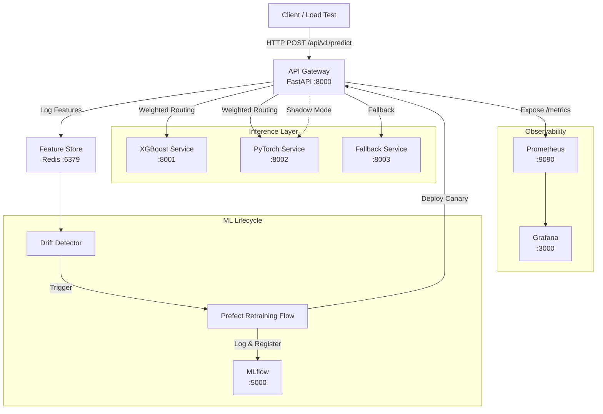
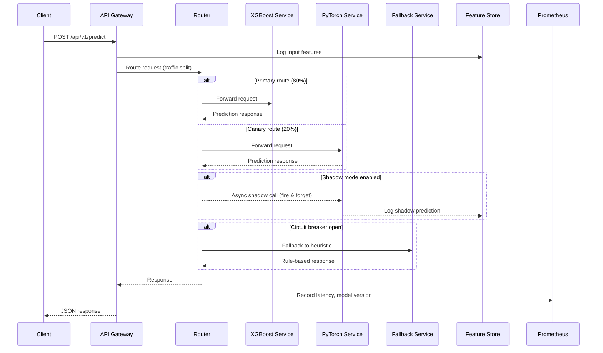
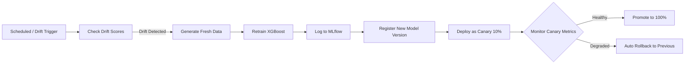

# Self-Healing ML Microservice Mesh — Architecture

## System Overview

## Request Flow

## Retraining & Rollback Flow

## Component Summary

| Component | Technology | Port | Purpose |
|-----------|-----------|------|---------|
| API Gateway | FastAPI | 8000 | Single entry point, routing, circuit breaker |
| XGBoost Service | FastAPI + XGBoost | 8001 | Primary ML model serving |
| PyTorch Service | FastAPI + PyTorch | 8002 | Secondary/canary model serving |
| Fallback Service | FastAPI | 8003 | Rule-based heuristic fallback |
| Feature Store | Redis | 6379 | Online feature storage & drift input |
| MLflow | MLflow Server | 5000 | Experiment tracking & model registry |
| Prometheus | Prometheus | 9090 | Metrics collection |
| Grafana | Grafana | 3000 | Dashboards & alerting |

## Failure Handling Strategy

1. **Service Failure**: Circuit breaker detects N consecutive failures → routes to fallback service
2. **Canary Degradation**: If canary model P95 latency or error rate exceeds threshold → auto-rollback to stable model
3. **Data Drift**: KS test / PSI exceeds threshold → triggers automated retraining pipeline
4. **Full Outage**: Fallback service provides rule-based predictions (no ML dependency)
5. **Recovery**: Health checks detect recovered services → gradually restore traffic routing
